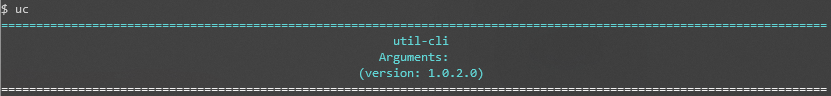


# util-cli

<br>
This project is for personal use and is focused on automations that fulfill specific tasks for the author of this repository. But it can be used to create automations for different types.

> A cli utility because using the mouse is not cool enough!

### Improvements

The project is still under development and future updates will focus on the following tasks: 

- [ ] Add future weather forecast.
- [ ] Create help command.
- [ ] Add license.

## 💻 Requirements

Before starting, make sure you have met the following requirements:

* .NET 6
* .NET Tool
* To use system-monitor (-t) install this tool: https://github.com/gsass1/NTop


## 🚀 Installing util-cli

To install util-cli globally, follow these steps:

For Linux or Windows, clone this repo and in the project folder **UtilCli.App.csproj** run the command:
```
dotnet pack && dotnet tool update --global --add-source ./nupkg UtilCli.App
```
For Windows users it is possible to configure a file in the path: **C:/UtilCli/config/settings.json** to configure some standard information of the utility, such as the process for querying Sicop, city for querying the weather forecast and section of the news blog from microsoft.
```
{
  "protocol-number": "0000000000000",
  "weather-city": "Rio de janeiro",
  "blog": "dotnet"
}
```

## ☕ How to use util-cli

To use util-cli, follow these steps:

Main command of this utility:
```
uc -params
```

Parameters:
* To execute system-monitor
```
uc -t
```
* To execute Clear Console
```
uc -c 
```
* To list top microsoft blog news - https://devblogs.microsoft.com/dotnet/
```
uc -b 
```
or
```
uc -b <section> (dotnet, visualstudio, etc)
```
* To print weather forecast - https://weather.com/
```
uc -w
```
or
```
uc -w <city-name> (rio de janeiro, sao paulo, missouri, etc)
```
* To restart pc
```
uc -r 
```
* To shutdown pc
```
uc -s 
```
* To get help (**improvement)
```
uc -s 
```
* To consult an administrative process of the Government of Rio de Janeiro - [SICOP - Sistema Único de Controle de Protocolo (rio.rj.gov.br)](http://www2.rio.rj.gov.br/sicop/sicop.asp)
```
uc -p <protocol-number> 
```

## 📫 Contributing to util-cli

To contribute util-cli, follow these steps:

1. Fork this repository.
2. Create a branch: `git checkout -b <branch_name>`.
3. Make your changes and commit them: `git commit -m '<commit_message>'`
4. Send to the original branch: `git push origin <project_name> / <location>`
5. Create the pull request.

Alternatively, see the GitHub documentation at [how to create a pull request](https://help.github.com/en/github/collaborating-with-issues-and-pull-requests/creating-a-pull-request).


## 📝 License

This project is under license. See the [LICENSE](LICENSE.md) file for more details. (**improvement)

[⬆ Back to the top](#Util-Cli)<br>